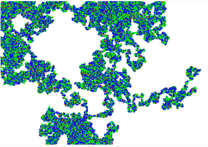

## Caminata aleatoria
Proceso en el que un "caminante" se mueve paso a paso en direcciones aleatorias dentro de un espacio definido. En cada paso, la dirección se elige al azar, y puede ser hacia arriba, abajo, izquierda o derecha (en el caso más simple).
En programación, una caminata aleatoria se crea usando un bucle donde en cada iteración se calcula la nueva posición basándose en una dirección aleatoria. Esto genera trayectorias que pueden parecer caóticas o dispersas dependiendo de las reglas del movimiento.

### Comprensión de código: 

**Clase Walker:**
Es el objeto principal que representa al "caminante".
Tiene dos propiedades (this.x y this.y) que marcan su posición actual en el lienzo, empezando en el centro.

**Método step():**
Define cómo se mueve el caminante.

Usa un número aleatorio entre 0 y 3 para decidir la dirección:

0: Mueve hacia la derecha (this.x++).

1: Mueve hacia la izquierda (this.x--).

2: Mueve hacia abajo (this.y++).

3: Mueve hacia arriba (this.y--).

**Método show():**
Dibuja un punto en la posición actual del caminante.
Bucle draw():

Se ejecuta continuamente, haciendo que el caminante dé un paso (step()) y se dibuje en su nueva posición (show()).

```js
// Declara una variable para almacenar el objeto "Walker"
let walker;

function setup() {
  // Crea un lienzo de 640x240 píxeles
  createCanvas(640, 240);

  // Inicializa un nuevo caminante (instancia de la clase Walker)
  walker = new Walker();

  // Establece el fondo en color blanco
  background(255);
}

function draw() {
  // Llama al método "step()" para que el caminante dé un paso
  walker.step();

  // Llama al método "show()" para dibujar al caminante en su nueva posición
  walker.show();
}

// Definición de la clase "Walker"
class Walker {
  // Constructor: inicializa la posición del caminante en el centro del lienzo
  constructor() {
    this.x = width / 2; // Coordenada X: mitad del ancho del lienzo
    this.y = height / 2; // Coordenada Y: mitad de la altura del lienzo
  }

  // Método "show()": dibuja al caminante en su posición actual
  show() {
    stroke(0); // Establece el color del punto en negro
    point(this.x, this.y); // Dibuja un punto en la posición actual (x, y)
  }

  // Método "step()": define cómo se mueve el caminante
  step() {
    // Genera un número entero aleatorio entre 0 y 3
    const choice = floor(random(4));

    // Elige una dirección de movimiento basada en el valor de "choice"
    if (choice == 0) {
      this.x++; // Si "choice" es 0, el caminante se mueve hacia la derecha (aumenta X)
    } else if (choice == 1) {
      this.x--; // Si "choice" es 1, el caminante se mueve hacia la izquierda (disminuye X)
    } else if (choice == 2) {
      this.y++; // Si "choice" es 2, el caminante se mueve hacia abajo (aumenta Y)
    } else {
      this.y--; // Si "choice" es 3, el caminante se mueve hacia arriba (disminuye Y)
    }
  }
}
```

### Experimento

Voy a modificar el código para que el tamaño del punto cambie aleatoriamente en cada paso, asignando diferentes colores según el tamaño. Esto permitirá que el caminante deje trazos de tamaños y colores variados, lo que podría generar un patrón visual más dinámico y fácil de identificar.

#### ¿Qué pregunta quieres responder con este experimento?
- ¿Cómo afecta la variación del tamaño de los puntos y su color a la visibilidad de los diferentes tamaños a lo largo de la caminata aleatoria?
- ¿Es fácil distinguir entre los diferentes tamaños de puntos en el canvas?
#### ¿Qué resultados esperas obtener?
Espero ver una caminata aleatoria con puntos de tres tamaños (1, 2 y 3 píxeles) que sean claramente visibles y diferenciables por su color (rojo, verde y azul). Cada tamaño debería tener su propio color distintivo, lo que permitirá ver la evolución de la caminata de manera más clara.

## Codigo:
El cambio se realizó en el método show(), añadiendo un tamaño aleatorio para el punto que dibuja el caminante entre 1 y 5.

```js
let walker;

function setup() {
  createCanvas(640, 240);
  walker = new Walker();
  background(255);
}

function draw() {
  for (let i = 0; i < 10; i++) { // Hacer que dé 10 pasos por fotograma
    walker.step();
    walker.show();
  }
}

class Walker {
  constructor() {
    this.x = width / 2; // Inicia en el centro del lienzo
    this.y = height / 2;
  }

  show() {
    const size = random(1, 3); // Tamaño aleatorio entre 1 y 3
    let col;

    // Asignar un color según el tamaño
    if (size <= 1.5) {
      col = color(255, 0, 0); // Rojo para los puntos más pequeños (1 px)
    } else if (size <= 2.5) {
      col = color(0, 255, 0); // Verde para los puntos medianos (2 px)
    } else {
      col = color(0, 0, 255); // Azul para los puntos más grandes (3 px)
    }

    stroke(col); // Color del punto
    strokeWeight(size); // Ajusta el grosor del punto
    point(this.x, this.y); // Dibuja el punto en la posición actual
  }

  step() {
    const choice = floor(random(4)); // Elige una dirección aleatoria
    if (choice == 0) {
      this.x++;
    } else if (choice == 1) {
      this.x--;
    } else if (choice == 2) {
      this.y++;
    } else {
      this.y--;
    }
    // Limita al caminante dentro del canvas
    this.x = constrain(this.x, 0, width);
    this.y = constrain(this.y, 0, height);
  }
}
```

#### ¿Qué resultados obtuviste?
 Los puntos de tamaño 1, 2 y 3 píxeles son fácilmente distinguibles por su color (rojo, verde y azul, respectivamente). La caminata aleatoria ahora se representa con diferentes colores que corresponden a los tamaños de los puntos, lo que permite observar claramente cómo el caminante se desplaza a través del lienzo.

#### ¿Qué aprendiste de este experimento?
Aprendí que al combinar variación en el tamaño y el color de los puntos, se mejora significativamente la visibilidad de los diferentes pasos en la caminata aleatoria. Esta modificación hace que sea mucho más fácil rastrear el movimiento del caminante, al mismo tiempo que agrega un componente visual interesante que hace que el experimento sea más dinámico y creativo. Además, experimenté cómo el tamaño y el color pueden influir en la percepción visual de una simulación interactiva.

#### Resultado:


