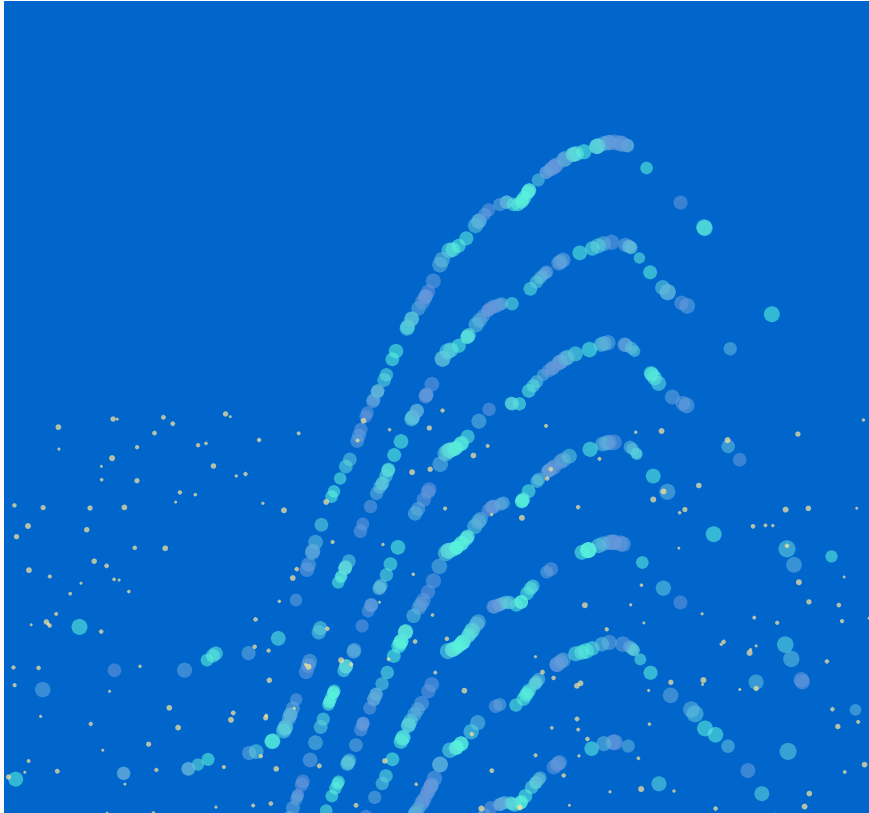

#### Código de la aplicación.
```js
let waveSpeed = 0.03;  // Velocidad de las olas
let waveHeight = 300;  // Altura de las olas
let waveIntensity = 1; // Intensidad de las olas
let noiseOffset = 0;   // Desplazamiento de ruido Perlin
let numWaves = 20     // Número de filas de olas
let numParticles = 100; // Más partículas para llenar la ola
let numSandParticles = 200; // Partículas de arena

let shapeType = 'circle'; // Forma predeterminada de las partículas

function setup() {
  createCanvas(windowWidth, windowHeight);
  noStroke();
}

function draw() {
  // Fondo completamente azul (más oscuro)
  background(0, 102, 204);  // Azul más oscuro para el mar

  // Dibujar las olas
  for (let i = 0; i < numWaves; i++) {
    drawWave(i * 100);  // Llamar a la función que dibuja cada ola
  }

  // Movimiento de las olas: modificar la posición de las olas con el tiempo
  noiseOffset += waveSpeed;

  // Dibujar las partículas de arena en la parte inferior
  drawSandParticles();
}

function drawWave(offset) {
  // Ajustamos la altura de las olas con el mouse
  let waveHeightMod = map(mouseY, 0, height, 50, waveHeight); 
  let waveIntensityMod = map(mouseX, 0, width, 0.5, waveIntensity);
  
  // Dibujar las partículas que simulan las olas
  for (let i = 0; i < numParticles; i++) {
    let x = 150 * randomGaussian() + width / 2;  // Aumentar la dispersión de partículas
    x = constrain(x, 0, width);  // Limitar la posición a la pantalla

    // Usamos ruido Perlin para las posiciones verticales de las partículas
    let y = height / 2 + sin(TWO_PI * (x / width) + noise(x * 0.01 + noiseOffset) * waveIntensityMod) * waveHeightMod;

    // Tamaño de las partículas basado en el ruido
    let size = map(noise(x * 0.05 + noiseOffset), 0, 1, 10, 20);
    
    // Gradiente de azul para las partículas con tonalidades variadas
    let baseColor = map(sin(x * 0.1), -1, 1, 0, 255);  // Base para la variación
    let color1 = map(baseColor, 0, 220, 100, 90);  // Azul más claro
    let color2 = map(baseColor, 0, 180, 150, 216);   // Azul más oscuro

    fill(color1, color2, 220, 150);  // Gradiente de azul en la partícula
    
    // Cambiar la forma de la partícula según `shapeType`
    if (shapeType === 'circle') {
      ellipse(x, y + offset, size, size);  // Círculo
    } else if (shapeType === 'square') {
      rect(x - size / 2, y + offset - size / 2, size, size);  // Cuadrado
    } else if (shapeType === 'triangle') {
      triangle(
        x, y + offset - size / 2,  // Parte superior
        x - size / 2, y + offset + size / 2,  // Esquina izquierda
        x + size / 2, y + offset + size / 2   // Esquina derecha
      );  // Triángulo
    }
  }
}

function drawSandParticles() {
  // Partículas de arena en la parte inferior de la pantalla
  for (let i = 0; i < numSandParticles; i++) {
    let x = random(width);  // Posición aleatoria en el eje X
    let y = random(height / 2, height);  // Posición aleatoria en la parte inferior

    // Tamaño aleatorio para las partículas de arena
    let size = random(3, 6);  

    // Color beige para simular arena
    fill(255, 229, 153, 180);  // Color beige con algo de transparencia

    // Dibujar la partícula de arena
    ellipse(x, y, size, size);
  }
}

function keyPressed() {
  // Modificar la velocidad de las olas con las teclas izquierda/derecha
  if (keyCode === LEFT_ARROW) {
    waveSpeed -= 0.05
  } else if (keyCode === RIGHT_ARROW) {
    waveSpeed += 0.03
  }
  
  // Cambiar la forma de las partículas al presionar la barra espaciadora
  if (keyCode === 32) { // Código de la barra espaciadora
    let randomShape = random();  // Generar un valor aleatorio entre 0 y 1
    if (randomShape < 0.33) {
      shapeType = 'circle';  // Seleccionar círculo
    } else if (randomShape < 0.66) {
      shapeType = 'square';  // Seleccionar cuadrado
    } else {
      shapeType = 'triangle';  // Seleccionar triángulo
    }
  }
}
```
#### Captura del contenido generado.





#### Cambios
Ninguno por el momento, quede contenta por asi decirlo, pues fue mas por lo grafico. 


