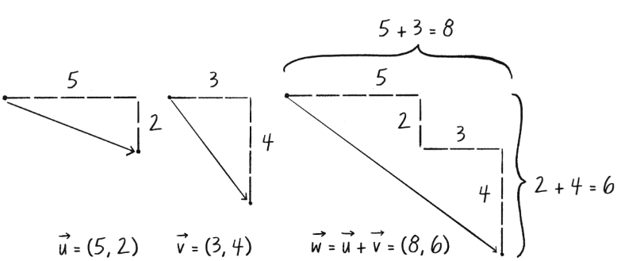

### Example 1.2: Bouncing Ball with Vectors!

#### ¿Cómo funciona la suma dos vectores?

Cada vector tiene dos componentes, una x y una y. Para sumar los dos vectores, sume los componentes x y para crear un nuevo vector. 



**Propiedades de suma con vectores** 
La suma con vectores sigue las mismas reglas algebraicas que con los números reales.
- Conmutativo: 
3+2=2+3
- Asociativo: 
(3+2)+1=3+(2+1)

En p5.js se usa 
```js
Vectoradd()Vector
```
La función busca los componentes x e y de los dos vectores y los suma por separado.
```js
 class Vector {

  constructor(x, y) {
    this.x = x;
    this.y = y;
  }
//Una función para agregar otro vector a este vector. Agregue los componentes x y los componentes y por separado.
  add(v) {
    this.x = this.x + v.x;
    this.y = this.y + v.y;
  }
}
```

#### ¿Por qué esta línea position = position + velocity; no funciona?

No funciona porque está intentando sumar dos vectores, pero los vectores necesitan sumarse componente por componente.

Se debe utilizar, ya que suma la velocidad a la posición.
```js
position.add(velocity);
```
Ejemplo: 
Si tengo una posición *position = (x, y)* y una velocidad *velocity = (xspeed, yspeed)*, para sumarlas debo:
```js
position.x = position.x + velocity.x;
position.y = position.y + velocity.y
```
De esta manera, estás sumando las componentes *x* y *y* de los vectores de forma correcta. En el código, se está sumando x y xspeed, y y y yspeed, lo cual funciona bien para este caso, pero cuando trabajamos con objetos como vectores, necesitamos referenciar cada componente por separado.
