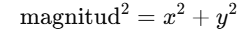

#### ¿Para qué sirve el método mag()? Nota que hay otro método llamado magSq(). ¿Cuál es la diferencia entre ambos? ¿Cuál es más eficiente?

**Mag**
- Calcula la magnitud (longitud) del vector.
- Utilice mag() para calcular la magnitud de un vector 2D utilizando componentes como en .mag(x, y)

Formula:

- Esto nos dice qué tan "largo" es el vector en el espacio.
  
**magSq**
- Calcula la magnitud (longitud) del vector al cuadrado.
  
  Formula:

  
- .magSq() calcula la magnitud al cuadrado, sin aplicar la raíz cuadrada.

- La diferencia es que magSq() no usa la raíz cuadrada, lo que lo hace más eficiente.
- magSq() es más rápido que mag() porque evita la operación de raíz cuadrada (sqrt()), que es costosa en términos de rendimiento.
- Si solo necesito comparar magnitudes de vectores (por ejemplo, saber cuál es más largo), es mejor usar magSq() en lugar de mag(), ya que es más eficiente.

#### ¿Para qué sirve el método normalize()?
- Escala los componentes de un p5. Objeto vectorial de modo que su magnitud sea 1.
- La versión estática de , como en , devuelve un nuevo p5. Vector y no cambia el original.normalize()p5.Vector.normalize(v).
- Para normalizar un vector, se divide cada componente entre su magnitud:
  
  

#### Te encuentras con un periodista en la calle y te pregunta ¿Para qué sirve el método dot()? ¿Qué le responderías en un frase?
-Calcula el producto escalar entre dos vectores.
- El producto escalar es un número que indica cuánto se parecen en dirección.
- Si los vectores son paralelos, el resultado es grande.
- Si son perpendiculares (90°), el resultado es 0.
- Si apuntan en direcciones opuestas, el resultado es negativo.
- La versión con un parámetro lo interpreta como otro p5. Objeto vectorial.dot()
- La versión con varios parámetros los interpreta como los componentes , , y de otro vector.dot()xyz
- La versión estática de , como en , es lo mismo que llamar a .dot()p5.Vector.dot(v1, v2)v1.dot(v2)o
  
Le diría que "El método dot() calcula el producto escalar de dos vectores. Es como medir cuánto se parecen en dirección. Si son paralelos, el resultado es grande; si son perpendiculares, es 0."

#### El método dot() tiene una versión estática y una de instancia. ¿Cuál es la diferencia entre ambas?
La diferencia entre la versión estática y la versión de instancia del método dot() en p5.js es la forma en que se usa:

**Versión de instancia (v1.dot(v2))**
- Se usa en un objeto vector existente.
- Se llama desde el propio vector y recibe otro vector o coordenadas como argumento.

**Versión estática (p5.Vector.dot(v1, v2)):**
- Se usa sin necesidad de tener un vector creado antes.
- Se llama directamente desde la clase p5.Vector y recibe dos vectores como argumentos.

- Usar v1.dot(v2) si ya tengo un vector y quieres compararlo con otro.
- Usar p5.Vector.dot(v1, v2) si necesito calcular el producto escalar sin modificar un vector específico.
#### Ahora el mismo periodista curioso de antes te pregunta si le puedes dar una intuición geométrica acerca del producto cruz. Entonces te pregunta ¿Cuál es la interpretación geométrica del producto cruz de dos vectores? Tu respuesta debe incluir qué pasa con la orientación y la magnitud del vector resultante.
- Calcula el producto cruzado de dos vectores.
- El producto cruzado es un vector que apunta directamente fuera del plano creado por dos vectores. La magnitud del producto cruzado es el área del paralelogramo formado por los dos vectores originales.
- La versión estática de , como en , es lo mismo que llamar a .cross()p5.Vector.cross(v1, v2)v1.cross(v2)

El producto cruz de dos vectores tiene una interpretación geométrica clara:

**1. El resultado es un nuevo vector perpendicular**

Si trabajas en 3D, el producto cruz de dos vectores genera un tercer vector perpendicular a ambos.
Es como si los vectores iniciales formaran un "plano", y el vector resultante apunta fuera de ese plano.
 
 **2. La magnitud representa el área del paralelogramo**

La longitud del vector resultante es igual al área del paralelogramo formado por los dos vectores originales.
Si los vectores son paralelos, el área es cero y el producto cruz también.

**3. La orientación sigue la regla de la mano derecha**

Si apuntas tu mano derecha con los dedos en la dirección del primer vector y los cierras hacia el segundo vector, el pulgar apunta en la dirección del vector resultante.

#### ¿Para que te puede servir el método dist()?

El método dist() sirve para calcular la distancia entre dos puntos en el espacio.
- Mide qué tan lejos están dos puntos: Si tengo dos puntos en un plano o en el espacio, dist() te dice la distancia entre ellos.
- Las coordenadas de un punto se pueden representar mediante los componentes de un vector que se extiende desde el origen hasta el punto.
- La versión estática de , como en , es lo mismo que llamar a .dist()p5.Vector.dist(v1, v2)v1.dist(v2)

Utilice dist() para calcular la distancia entre puntos utilizando coordenadas como en .dist(x1, y1, x2, y2)

#### ¿Para qué sirven los métodos normalize() y limit()?
**Normalize**
- Sirve para convertir un vector en una versión más pequeña pero con la misma dirección.
- Básicamente, "estira" o "encoge" el vector para que su tamaño sea exactamente 1.
- Se usa cuando solo importa la dirección del vector, no su tamaño.

*Ejemplo:*

Si un vector es (3,4), al normalizarlo se convertirá en (~0.6, ~0.8), pero seguirá apuntando en la misma dirección.
let v = createVector(3, 4);
v.normalize();
console.log(v);  // Ahora su magnitud es 1

**Límit**
- Si un vector es demasiado grande, limit() lo reduce a un máximo permitido, limita la magnitud de un vector a un valor máximo.
- Funciona como un "freno" para que no crezca más allá de cierto tamaño.
- La versión estática de , como en , devuelve un nuevo p5. Vector y no cambia el original.limit()p5.Vector.limit(v, 5)

*Ejemplo:*

Si un vector tiene magnitud 10 y usamos limit(5), su tamaño bajará a 5, pero mantendrá la dirección.

  let v = createVector(10, 10);
v.limit(5);
console.log(v);  // Su magnitud no será mayor a 5
