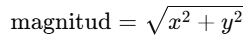

#### ¿Para qué sirve el método mag()? Nota que hay otro método llamado magSq(). ¿Cuál es la diferencia entre ambos? ¿Cuál es más eficiente?

**Mag**
- Calcula la magnitud (longitud) del vector.
- Utilice mag() para calcular la magnitud de un vector 2D utilizando componentes como en .mag(x, y)
Formula: 
- Esto nos dice qué tan "largo" es el vector en el espacio.
  
**magSq**
- Calcula la magnitud (longitud) del vector al cuadrado.
  Formula: 
- .magSq() calcula la magnitud al cuadrado, sin aplicar la raíz cuadrada.

- La diferencia es que magSq() no usa la raíz cuadrada, lo que lo hace más eficiente.
- magSq() es más rápido que mag() porque evita la operación de raíz cuadrada (sqrt()), que es costosa en términos de rendimiento.
- Si solo necesito comparar magnitudes de vectores (por ejemplo, saber cuál es más largo), es mejor usar magSq() en lugar de mag(), ya que es más eficiente.
#### ¿Para qué sirve el método normalize()?

#### Te encuentras con un periodista en la calle y te pregunta ¿Para qué sirve el método dot()? ¿Qué le responderías en un frase?
#### El método dot() tiene una versión estática y una de instancia. ¿Cuál es la diferencia entre ambas?
#### Ahora el mismo periodista curioso de antes te pregunta si le puedes dar una intuición geométrica acerca del producto cruz. Entonces te pregunta ¿Cuál es la interpretación geométrica del producto cruz de dos vectores? Tu respuesta debe incluir qué pasa con la orientación y la magnitud del vector resultante.
#### ¿Para que te puede servir el método dist()?
#### ¿Para qué sirven los métodos normalize() y limit()?
