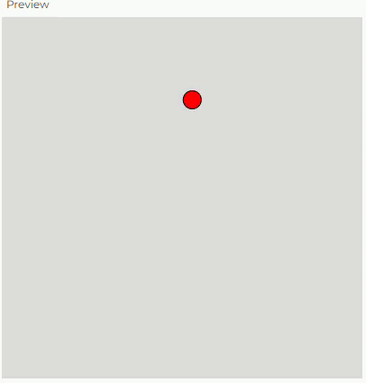

#### ¿En qué consiste motion 101?

**Motion 101**
- Suma la velocidad a la posición → Esto hace que el objeto se mueva.
- Dibuja el objeto en la posición → Para que el movimiento sea visible en el lienzo.

En Motion 101, cada objeto en movimiento tiene dos propiedades clave:
- Posición (position) → Define dónde está el objeto.
- Velocidad (velocity) → Define qué tan rápido y en qué dirección se mueve.

Cada cuadro (draw() en p5.js), el programa actualiza la posición sumando la velocidad. Si no se modifica la velocidad, el objeto se moverá en línea recta constantemente.

**Encapsulación en una Clase (Mover)**

Para organizar mejor el código y hacer objetos reutilizables, se encapsula este comportamiento en una clase. Una clase Mover puede incluir:

- Datos:
  - position (posición del objeto)
  - velocity (velocidad del objeto)

- Funcionalidad:
  - update() → Actualiza la posición sumando la velocidad.
  - display() → Dibuja el objeto en su nueva posición.
  - checkEdges() → Detecta colisiones con los bordes para hacer que rebote.

Así, el objeto se mueve por sí solo sin tener que escribir todo el código dentro de draw().

#### Ejemplo: 

```js
//La clase Mover encapsula el comportamiento del objeto en movimiento
class Mover {
  constructor() {
    this.position = createVector(random(width), random(height)); // Posición inicial aleatoria
    this.velocity = createVector(random(-4, 5), random(-4, 5)); // Velocidad aleatoria
  }
// Aplicación Motion 101, haciendo que el objeto se mueva
  update() {
    this.position.add(this.velocity); // Motion 101: Sumar velocidad a la posición
  }
//Verifica si el objeto se ha salido del lienzo y lo hace rebotar si es necesario
  checkEdges() {
    if (this.position.x > width || this.position.x < 0) {
      this.velocity.x *= -1; // Rebote horizontal
    }
    if (this.position.y > height || this.position.y < 0) {
      this.velocity.y *= -1; // Rebote vertical
    }
  }

  display() {
    fill(255, 0, 0);
    ellipse(this.position.x, this.position.y, 20, 20);
  }
}

let mover;//Variable global mover para almacenar la instancia de la clase

function setup() {
  createCanvas(400, 400);
  mover = new Mover(); //Crea un nuevo objeto Mover, inicializándolo con una posición y velocidad aleatorias.
}

function draw() {
  background(220);
  mover.update(); //Actualiza la posición del objeto
  mover.checkEdges(); // Verifica si se ha salido del lienzo y lo hace rebotar
  mover.display();// Dibuja el objeto en la nueva posición
}
```

