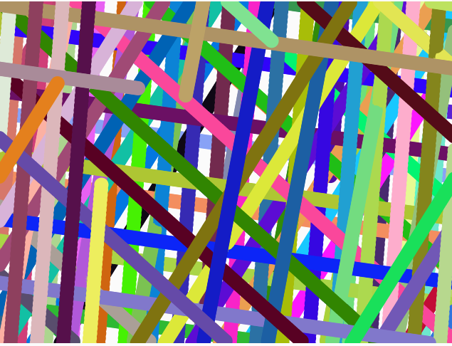

#### Código de la aplicación.
```js
let particles = [];
let numParticles = 6000;
let center;
let colors;
let a = 0;
let b = 0.4;
let prevMouseX;

function setup() {
  createCanvas(600, 600);
  center = createVector(width / 2, height / 2);
  colors = [
    color('#8B4513'), // SaddleBrown
    color('#A0522D'), // Sienna
    color('#CD853F'), // Peru
    color('#D2691E'), // Chocolate
    color('#F4A460'), // SandyBrown
    color('#DEB887'), // BurlyWood
    color('#D2B48C'), // Tan
    color('#DAA520'), // GoldenRod
    color('#C19A6B')  // Light Brown
  ];
  
  for (let i = 0; i < numParticles; i++) {
    particles.push(new Particle(random(TWO_PI), random(50, 250)));
  }
  
  frameRate(60);
  prevMouseX = mouseX;
}

function draw() {
  background(0);
  translate(width / 2, height / 2);
  rotate(radians(a));
  
  for (let p of particles) {
    p.update();
    p.show();
  }
  
  // Dibujar la pupila con efecto dinámico y aceleración constante
  for (let i = 0; i < 300; i++) {
    let angle = random(TWO_PI);
    let radius = random(10, 40);
    let x = radius * cos(angle);
    let y = radius * sin(angle);
    fill(255, random(100, 255));
    noStroke();
    ellipse(x, y, random(2, 6));
  }
  
  // Ajustar velocidad de rotación según movimiento del mouse con mayor efecto
  let mouseSpeed = mouseX - prevMouseX;
  if (mouseSpeed > 0) {
    b = map(mouseSpeed, 0, width, 0.1, 0.5);
  } else if (mouseSpeed < 0) {
    b = map(abs(mouseSpeed), 0, width, 0.05, 0.2);
  }
  prevMouseX = mouseX;
  
  a += b;
}

class Particle {
  constructor(angle, radius) {
    this.angle = angle;
    this.radius = radius;
    this.baseRadius = radius;
    this.speed = random(0.002, 0.008);
    this.colorA = colors[int(random(colors.length))];
    this.colorB = colors[int(random(colors.length))];
    this.lerpFactor = random(0.01, 0.05);
    this.color = this.colorA;
  }

  update() {
    this.angle += this.speed;
    this.radius = lerp(this.radius, this.baseRadius + sin(frameCount * 0.01) * 10, 0.1);
    this.color = lerpColor(this.color, this.colorB, this.lerpFactor);
    
    if (frameCount % 100 == 0) {
      this.colorA = this.colorB;
      this.colorB = colors[int(random(colors.length))];
    }
  }

  show() {
    let x = this.radius * cos(this.angle);
    let y = this.radius * sin(this.angle);
    
    fill(this.color);
    noStroke();
    ellipse(x, y, 5);
  }
}
```
#### Captura del contenido generado.

