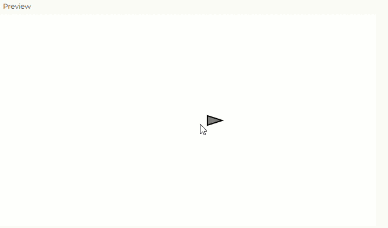

```js
// Simulación de un vehículo que se mueve con las flechas izquierda y derecha.

class Vehicle {
  constructor() {
    // Posición inicial en el centro de la pantalla
    this.position = createVector(width / 2, height / 2);
    
    // Velocidad inicial en cero
    this.velocity = createVector(0, 0);
    
    // Aceleración inicial en cero
    this.acceleration = createVector(0, 0);
    
    // Máxima velocidad del vehículo
    this.topspeed = 4;
    
    // Radio del vehículo
    this.r = 16;
  }

  applyForce(force) {
    // Suma la fuerza a la aceleración
    this.acceleration.add(force);
  }

  update() {
    // Agregamos la aceleración a la velocidad
    this.velocity.add(this.acceleration);
    
    // Limitamos la velocidad para que no sea infinita
    this.velocity.limit(this.topspeed);
    
    // Sumamos la velocidad a la posición
    this.position.add(this.velocity);
    
    // Reiniciamos la aceleración para que no se acumule indefinidamente
    this.acceleration.mult(0);
  }

  display() {
    // Calculamos el ángulo de rotación con base en la dirección del movimiento
    let angle = this.velocity.heading();
    
    stroke(0);
    strokeWeight(2);
    fill(127);
    
    // Guardamos el estado de la transformación
    push();
    
    // Centramos el vehículo en su posición actual
    translate(this.position.x, this.position.y);
    
    // Rotamos el vehículo en la dirección de su velocidad
    rotate(angle);
    
    // Dibujamos un triángulo que representa al vehículo
    beginShape();
    vertex(0, -this.r); // Punta del triángulo
    vertex(-this.r / 2, this.r); // Parte izquierda
    vertex(this.r / 2, this.r); // Parte derecha
    endShape(CLOSE);
    
    // Restauramos el estado original de la transformación
    pop();
  }
}

let vehicle;

function setup() {
  createCanvas(640, 360);
  vehicle = new Vehicle();
}

function draw() {
  background(255);
  
  // Movimiento del vehículo con las teclas de flecha
  if (keyIsDown(LEFT_ARROW)) {
    vehicle.applyForce(createVector(-0.1, 0)); // Acelera hacia la izquierda
  }
  if (keyIsDown(RIGHT_ARROW)) {
    vehicle.applyForce(createVector(0.1, 0)); // Acelera hacia la derecha
  }

  vehicle.update(); // Actualiza la posición y velocidad
  vehicle.display(); // Dibuja el vehículo
}
```



[Aplicación](https://editor.p5js.org/Majogc8/sketches/mC7KnDHUP)
