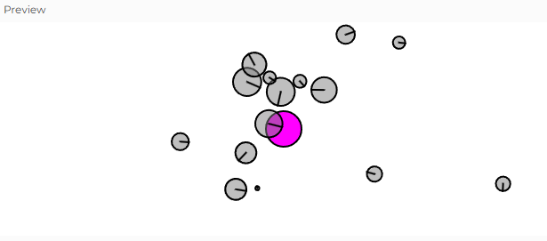
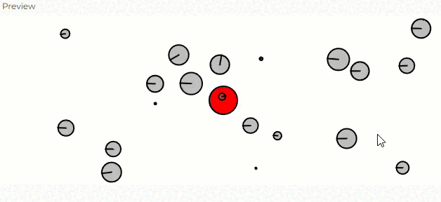

Esta simulación representa un sistema donde múltiples objetos (Mover) son atraídos por un punto central (Attractor).

Cada objeto tiene masa, velocidad y aceleración, y responde a fuerzas externas.

#### 1. Identificación de Motion 101

El Motion 101 es un marco conceptual que describe el movimiento de objetos en términos de posición, velocidad y aceleración. La idea clave es que:

La aceleración afecta la velocidad.
La velocidad afecta la posición.

```js
update() {
  this.velocity.add(this.acceleration); // La aceleración modifica la velocidad
  this.position.add(this.velocity); // La velocidad modifica la posición
  this.acceleration.mult(0); // Se reinicia la aceleración después de cada actualización
}
```

#### 2. ¿Qué modificación hay que hacer para agregar fuerzas acumulativas?

En Motion 101 básico, la aceleración se establece directamente (por ejemplo, apuntando hacia el mouse). Sin embargo, si queremos agregar fuerzas acumulativas, en vez de reiniciar la aceleración cada cuadro, debemos permitir que las fuerzas se sumen con el tiempo.

La modificación clave está en cómo aplicamos la fuerza

```js
applyForce(force) {
  let f = p5.Vector.div(force, this.mass); // F = ma (fuerza dividida por masa)
  this.acceleration.add(f); // Se acumulan fuerzas en cada cuadro
}
```
##### ¿Por qué es necesario hacer esta modificación?
Porque en la vida real, los objetos no solo responden a una única fuerza en cada instante, sino que las fuerzas pueden acumularse. Por ejemplo, la gravedad y la resistencia del aire afectan un objeto al mismo tiempo.

#### 3. Identificar el Attractor en la simulación

- El Attractor es el objeto que genera la fuerza de atracción para los Mover. 

```js
let attractor;
attractor = new Attractor();
```

- En la función draw(), el Attractor interactúa con cada Mover:

```js
attractor.display(); // Dibuja el atractor

for (let i = 0; i < movers.length; i++) {
  let force = attractor.attract(movers[i]); // Calcula la fuerza de atracción
  movers[i].applyForce(force); // Aplica la fuerza al objeto

  movers[i].update(); // Actualiza el movimiento del objeto
  movers[i].show(); // Dibuja el objeto
}
```

#### 4. Cambio del color del Attractor
En la clase attractor cambiamos el color a morado 

```js
 // Method to display
  display() {
    ellipseMode(CENTER);
    stroke(0);
    if (this.dragging) {
      fill(255,0,255);
    } else if (this.rollover) {
      fill(255,0,255);
    } else {
      fill(255,0,255);
    }
    ellipse(this.position.x, this.position.y, this.mass * 2);
  }
}
```



#### Mover el attractor con el mouse y cambiar su color cuando el mouse está sobre él.

**this.dragging:** Es un booleano (valor true o false) que indica si el usuario está arrastrando el Attractor con el mouse.
- Cuando this.dragging = true, el Attractor sigue la posición del mouse.
- Cuando this.dragging = false, el Attractor permanece quieto.

**this.rollover:** También es un booleano (true o false), pero en este caso indica si el mouse está encima del Attractor.
- Cuando this.rollover = true, cambiamos el color del Attractor para indicar que podemos arrastrarlo.
- Cuando this.rollover = false, el Attractor vuelve a su color normal.

Para que funciones el ejercicio: 
- mousePressed() → Detecta si el usuario hace clic sobre el Attractor.
- mouseReleased() → Suelta el Attractor cuando el usuario suelta el clic.
- mouseDragged() → Mueve el Attractor si está siendo arrastrado.
- Verificamos si el mouse está sobre el Attractor cambiando su color con rollover.

1. debemos asegurarnos de que update() se llame dentro de draw() para que la detección de rollover y el arrastre funcionen correctamente.
```js
let movers = [];
let attractor; // Objeto atractor (atrae a los Movers)

function setup() {
  createCanvas(640, 240);

   // Crear 20 objetos Mover con posición y masa aleatorias
  for (let i = 0; i < 20; i++) {
    movers.push(new Mover(random(width), random(height), random(0.1, 2)));
  }
  
  attractor = new Attractor();// Crear el objeto Attractor
}

function draw() {
  background(255);
// ESTA PARTE 
  attractor.update(); // ← Agrega esta línea para actualizar el atractor
  attractor.display();

  for (let i = 0; i < movers.length; i++) { 
    let force = attractor.attract(movers[i]); // Obtener la fuerza de atracción del atractor
    movers[i].applyForce(force);

    movers[i].update();
    movers[i].show();
  }
}
```
2. Cambio colores
```js
// Genera fuerza gravitacional
class Attractor {
  constructor() {
    this.position = createVector(width / 2, height / 2);
    this.mass = 20; // Masa del atractor (mayor que la de los Movers)
    this.G = 1;// Constante gravitacional
    this.dragging = false; // Indica si se está arrastrando
    this.rollover = false; // Indica si el mouse está encima
    this.offset = createVector(0, 0); // Compensa la posición al arrastrar
  }
  
  // Método que genera la fuerza de atracción sobre un Mover
  attract(mover) {
    // Calculate direction of force
    let force = p5.Vector.sub(this.position, mover.position);
    // Distance between objects
    let distance = force.mag();
    // Limiting the distance to eliminate "extreme" results for very close or very far objects
    distance = constrain(distance, 5, 25);

    // Calculate gravitional force magnitude
    let strength = (this.G * this.mass * mover.mass) / (distance * distance);
    // Get force vector --> magnitude * direction
    force.setMag(strength);
    return force;
  }

//AGREGAMOS UN UPDATE
   update() {
    // Verificar si el mouse está sobre el Attractor
    let d = dist(mouseX, mouseY, this.position.x, this.position.y);
    this.rollover = d < this.mass; // Si está cerca, rollover es true

    // Si se está arrastrando, actualiza la posición al mouse
    if (this.dragging) {
      this.position.x = mouseX + this.offset.x;
      this.position.y = mouseY + this.offset.y;
    }
  }

  
  
  // Method to display
  display() {
    ellipseMode(CENTER);
    stroke(0);
    
    if (this.dragging) {
      fill(150,0,0);// Rojo oscuro si se está arrastrando
    } else if (this.rollover) {
      fill(255,100,100); // Rojo claro si el mouse está encima
    } else {
      fill(255,0,0);// Rojo normal
    }
    
    ellipse(this.position.x, this.position.y, this.mass * 2);
  }
  
}
// Eventos del mouse (deben estar fuera de la clase)
function mousePressed() {
  let d = dist(mouseX, mouseY, attractor.position.x, attractor.position.y);
  if (d < attractor.mass) {
    attractor.dragging = true;
    attractor.offset.x = attractor.position.x - mouseX;
    attractor.offset.y = attractor.position.y - mouseY;
  }
}
 // FUNCIONES DEL MOUSE
function mouseReleased() {
  attractor.dragging = false;
}
```

