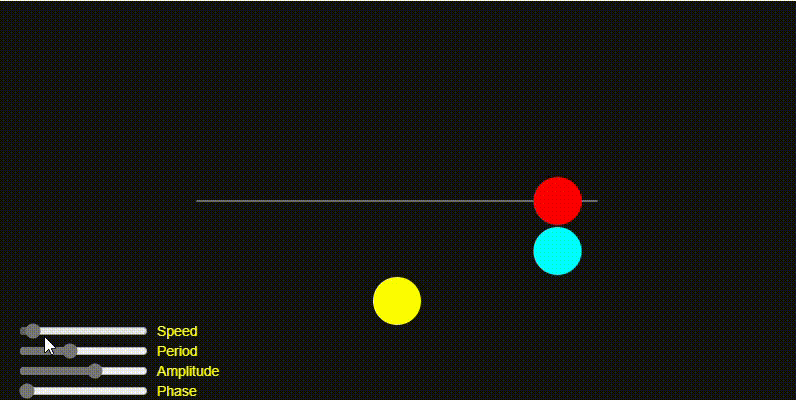

```js
// Arreglo para almacenar los osciladores
let oscillators = []; 

// Color base para los osciladores
let baseColor; 

// Vector de aceleración constante (fuerza de viento) que afectará a los osciladores
let wind;

function setup() {
  createCanvas(640, 360); 
  
  baseColor = color(50, 100, 200); // Define un color base azul oscuro
  
  wind = createVector(0, 0); // Inicializa la aceleración del viento en (0,0), sin movimiento
  
  // Crea 10 osciladores y los agrega al arreglo
  for (let i = 0; i < 10; i++) {
    oscillators.push(new Oscillator(i, 10)); 
  }
}

function draw() {
  background(240); 

  // Recorre el arreglo de osciladores y actualiza su movimiento
  for (let i = 0; i < oscillators.length; i++) {
    oscillators[i].applyForce(wind); // Aplica la fuerza del viento a cada oscilador
    oscillators[i].update(); // Actualiza su ángulo y velocidad
    oscillators[i].show(); // Dibuja el oscilador en pantalla
  }
}

// Definimos la clase Oscillator para manejar el movimiento oscilatorio
class Oscillator {
  constructor(index, total) {
    // Crea un vector de ángulos inicial con valores aleatorios entre 0 y 2*PI
    this.angle = createVector(random(TWO_PI), random(TWO_PI)); 
    
    // Crea una velocidad inicial para cada oscilador con valores pequeños aleatorios
    this.angleVelocity = createVector(random(-0.05, 0.05), random(-0.05, 0.05));
    
    // Inicialmente, la aceleración del ángulo es cero
    this.angleAcceleration = createVector(0, 0); 
    
    // Define la amplitud del movimiento en X e Y de manera aleatoria
    this.amplitude = createVector(
      random(50, width / 2),
      random(50, height / 2)
    );

    // Calcula un color basado en el índice del oscilador
    let factor = map(index, 0, total, 0.3, 1); // Ajusta el brillo de menor a mayor
    this.color = lerpColor(baseColor, color(255), factor); // Mezcla entre azul y blanco
  }

  // Aplica una fuerza al oscilador (modifica su aceleración)
  applyForce(force) {
    this.angleAcceleration.add(force);
  }

  // Actualiza el estado del oscilador en cada frame
  update() {
    this.angleVelocity.add(this.angleAcceleration); // La aceleración afecta la velocidad
    this.angle.add(this.angleVelocity); // La velocidad cambia el ángulo (movimiento)
    this.angleVelocity.limit(0.1); // Limita la velocidad para evitar movimientos exagerados
    this.angleAcceleration.mult(0); // Resetea la aceleración después de aplicarla
  }

  // Dibuja el oscilador en pantalla
  show() {
    // Calcula la posición en la que debe estar el círculo usando funciones seno
    let x = sin(this.angle.x) * this.amplitude.x;
    let y = sin(this.angle.y) * this.amplitude.y;

    push(); // Guarda la configuración actual de dibujo
    translate(width / 2, height / 2); // Mueve el punto de origen al centro del canvas
    stroke(0); // Define el color del borde como negro
    strokeWeight(2); // Grosor de la línea
    fill(this.color); // Rellena el círculo con su color asignado

    // Dibuja una línea desde el centro (0,0) hasta la posición (x, y)
    line(0, 0, x, y); 

    // Dibuja un círculo en la posición (x, y) con un tamaño de 20 píxeles
    circle(x, y, 20); 

    pop(); // Restaura la configuración anterior del dibujo
  }
}

// Función para detectar cuando se presiona una tecla
function keyPressed() {
  if (keyCode === RIGHT_ARROW) {
    wind.x += 0.002; // Aumenta la fuerza del viento hacia la derecha
  } else if (keyCode === LEFT_ARROW) {
    wind.x -= 0.002; // Aumenta la fuerza del viento hacia la izquierda
  } else if (keyCode === UP_ARROW) {
    wind.y -= 0.002; // Aumenta la fuerza del viento hacia arriba
  } else if (keyCode === DOWN_ARROW) {
    wind.y += 0.002; // Aumenta la fuerza del viento hacia abajo
  }
}

```



[Repaso](https://editor.p5js.org/Majogc8/sketches/rEq72mm7F) 
